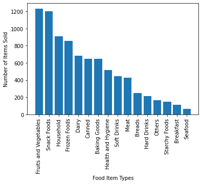
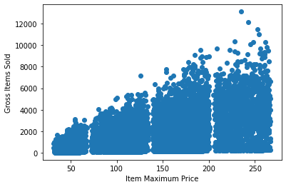
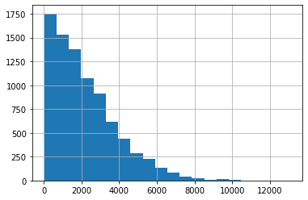
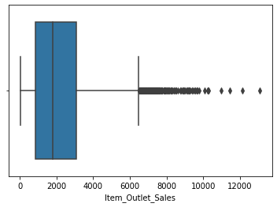

# Predicting Future Item Sales for Big Mart
- This repository is a project I created for predicting food sales for a theoretical company called Big Mart. Completed with Python/Pandas.
- Source data can be found here: https://datahack.analyticsvidhya.com/contest/practice-problem-big-mart-sales-iii/ and original .csv is saved within this repository.
- A 10-minute video presentation (Presentation.mp4) of my findings can be found in the 'Presentation_Recording' folder within this repository.

> ## My goal was to create the most precise Machine Learning model based on the company's prior sales trends. Our target is to predict the total number of sales of a specific item per outlet (outlet being a grocery store, supermarket, etc.), based on prior sales data.  We then would apply that to future/new items the company may introduce to sell, to get a solid predictive estimate of the number of sales per outlet it would likely generate.

## Based on my findings and Exploratory Data Analysis, we would want to employ a Random Forest regression model to the data to best predict future sales.
Conclusion: My Random Forest model achieved a testing score of 59.3%, so it seems that ~60% is the max our testing data will get with these methods.
**Positive: The model features accounted for over 93% of the variance in the data.**
At this point, if I wanted to get a better machine learning model, I'd go back and find a way to eliminate one of the original features columns.  The best idea might be to talk to executives of the company so that I might glean which features may not have much relevance to the total sales (possibly skewing the results), and re-run the models.  If that didn't make much progress in improving the accuracy, then I would investigate a more complex method that might be more relevant to the dataset provided.

> My slide presentation of the data can be found in this repository or link here: (https://github.com/dcnarch/sales-predictions/blob/main/BigMart%20Sales%20Presentation.pptx)

> Python code can be viewed in the 'Sales_Predictions_Final.ipynb' file contained within this repository.

Sources used for reference:

- https://www.shanelynn.ie/using-pandas-dataframe-creating-editing-viewing-data-in-python/

- https://pandas.pydata.org/pandas-docs/stable/reference/api/pandas.get_dummies.html)

